# 📊 Modelo de Dados - SkillMais MVP

## Diagrama de Entidade Relacionamento (DER)

```mermaid
erDiagram
    USUARIO {
        int id PK
        varchar nome
        varchar email UK
        varchar telefone
        enum tipo "contratante/prestador"
        timestamp data_cadastro
        timestamp created_at
        timestamp updated_at
    }
    
    ENDERECO {
        int id PK
        int usuario_id FK
        varchar cep
        varchar logradouro
        varchar numero
        varchar complemento
        varchar bairro
        varchar cidade
        varchar estado
        decimal latitude
        decimal longitude
        timestamp created_at
        timestamp updated_at
    }
    
    CATEGORIA {
        int id PK
        varchar nome UK
        text descricao
        varchar icone
        boolean ativo
        timestamp created_at
        timestamp updated_at
    }
    
    SERVICO {
        int id PK
        int prestador_id FK
        int categoria_id FK
        varchar titulo
        text descricao
        decimal preco_base
        boolean ativo
        timestamp created_at
        timestamp updated_at
    }
    
    PORTFOLIO {
        int id PK
        int servico_id FK
        varchar url_imagem
        text descricao
        int ordem
        timestamp created_at
        timestamp updated_at
    }
    
    AGENDAMENTO {
        int id PK
        int contratante_id FK
        int servico_id FK
        datetime data_hora
        enum status "pendente/confirmado/em_andamento/concluido/cancelado"
        text observacoes
        decimal valor_acordado
        timestamp created_at
        timestamp updated_at
    }
    
    MENSAGEM {
        int id PK
        int remetente_id FK
        int destinatario_id FK
        int agendamento_id FK
        text conteudo
        boolean lida
        timestamp data_hora
        timestamp created_at
    }
    
    AVALIACAO {
        int id PK
        int contratante_id FK
        int prestador_id FK
        int servico_id FK
        int agendamento_id FK
        int nota "1-5"
        text comentario
        timestamp data
        timestamp created_at
    }
    
    %% Relacionamentos
    USUARIO ||--o{ ENDERECO : possui
    USUARIO ||--o{ SERVICO : oferece
    USUARIO ||--o{ AGENDAMENTO : solicita
    USUARIO ||--o{ MENSAGEM : envia
    USUARIO ||--o{ MENSAGEM : recebe
    USUARIO ||--o{ AVALIACAO : faz
    USUARIO ||--o{ AVALIACAO : recebe
    
    CATEGORIA ||--o{ SERVICO : classifica
    
    SERVICO ||--o{ PORTFOLIO : possui
    SERVICO ||--o{ AGENDAMENTO : agendado_em
    SERVICO ||--o{ AVALIACAO : avaliado_em
    
    AGENDAMENTO ||--o{ MENSAGEM : gera
    AGENDAMENTO ||--o| AVALIACAO : resulta_em
```

## 📋 Descrição das Entidades

### 👤 USUARIO
Entidade central que representa todos os usuários da plataforma.

| Campo | Tipo | Descrição |
|-------|------|-----------|
| `id` | INT (PK) | Identificador único do usuário |
| `nome` | VARCHAR | Nome completo do usuário |
| `email` | VARCHAR (UK) | Email único para autenticação |
| `telefone` | VARCHAR | Número de telefone para contato |
| `tipo` | ENUM | Tipo de usuário: "contratante" ou "prestador" |
| `data_cadastro` | TIMESTAMP | Data e hora do primeiro cadastro |
| `created_at` | TIMESTAMP | Data de criação do registro |
| `updated_at` | TIMESTAMP | Data da última atualização |

### 📍 ENDERECO
Armazena os endereços dos usuários para localização de serviços.

| Campo | Tipo | Descrição |
|-------|------|-----------|
| `id` | INT (PK) | Identificador único do endereço |
| `usuario_id` | INT (FK) | Referência ao usuário proprietário |
| `cep` | VARCHAR | Código de Endereçamento Postal |
| `logradouro` | VARCHAR | Nome da rua/avenida |
| `numero` | VARCHAR | Número do imóvel |
| `complemento` | VARCHAR | Informações adicionais (opcional) |
| `bairro` | VARCHAR | Nome do bairro |
| `cidade` | VARCHAR | Nome da cidade |
| `estado` | VARCHAR | Estado/UF |
| `latitude` | DECIMAL | Coordenada geográfica (latitude) |
| `longitude` | DECIMAL | Coordenada geográfica (longitude) |

### 🏷️ CATEGORIA
Classificação dos tipos de serviços disponíveis na plataforma.

| Campo | Tipo | Descrição |
|-------|------|-----------|
| `id` | INT (PK) | Identificador único da categoria |
| `nome` | VARCHAR (UK) | Nome único da categoria |
| `descricao` | TEXT | Descrição detalhada da categoria |
| `icone` | VARCHAR | URL ou nome do ícone representativo |
| `ativo` | BOOLEAN | Status de ativação da categoria |

### 🔧 SERVICO
Serviços oferecidos pelos prestadores cadastrados.

| Campo | Tipo | Descrição |
|-------|------|-----------|
| `id` | INT (PK) | Identificador único do serviço |
| `prestador_id` | INT (FK) | Referência ao usuário prestador |
| `categoria_id` | INT (FK) | Referência à categoria do serviço |
| `titulo` | VARCHAR | Título/nome do serviço |
| `descricao` | TEXT | Descrição detalhada do serviço |
| `preco_base` | DECIMAL | Preço base do serviço |
| `ativo` | BOOLEAN | Status de disponibilidade do serviço |

### 🖼️ PORTFOLIO
Galeria de imagens e trabalhos realizados pelos prestadores.

| Campo | Tipo | Descrição |
|-------|------|-----------|
| `id` | INT (PK) | Identificador único do item do portfólio |
| `servico_id` | INT (FK) | Referência ao serviço relacionado |
| `url_imagem` | VARCHAR | URL da imagem do trabalho |
| `descricao` | TEXT | Descrição do trabalho realizado |
| `ordem` | INT | Ordem de exibição na galeria |

### 📅 AGENDAMENTO
Solicitações de serviços feitas pelos contratantes.

| Campo | Tipo | Descrição |
|-------|------|-----------|
| `id` | INT (PK) | Identificador único do agendamento |
| `contratante_id` | INT (FK) | Referência ao usuário contratante |
| `servico_id` | INT (FK) | Referência ao serviço solicitado |
| `data_hora` | DATETIME | Data e horário agendado para o serviço |
| `status` | ENUM | Status do agendamento (pendente/confirmado/em_andamento/concluido/cancelado) |
| `observacoes` | TEXT | Observações adicionais do contratante |
| `valor_acordado` | DECIMAL | Valor final acordado entre as partes |

### 💬 MENSAGEM
Sistema de comunicação entre contratantes e prestadores.

| Campo | Tipo | Descrição |
|-------|------|-----------|
| `id` | INT (PK) | Identificador único da mensagem |
| `remetente_id` | INT (FK) | Referência ao usuário que enviou |
| `destinatario_id` | INT (FK) | Referência ao usuário que recebeu |
| `agendamento_id` | INT (FK) | Referência ao agendamento relacionado |
| `conteudo` | TEXT | Conteúdo da mensagem |
| `lida` | BOOLEAN | Status de leitura da mensagem |
| `data_hora` | TIMESTAMP | Data e hora do envio |

### ⭐ AVALIACAO
Sistema de avaliação e feedback pós-serviço.

| Campo | Tipo | Descrição |
|-------|------|-----------|
| `id` | INT (PK) | Identificador único da avaliação |
| `contratante_id` | INT (FK) | Referência ao usuário que avaliou |
| `prestador_id` | INT (FK) | Referência ao usuário avaliado |
| `servico_id` | INT (FK) | Referência ao serviço avaliado |
| `agendamento_id` | INT (FK) | Referência ao agendamento avaliado |
| `nota` | INT | Nota de 1 a 5 estrelas |
| `comentario` | TEXT | Comentário opcional sobre o serviço |
| `data` | TIMESTAMP | Data da avaliação |

## 🔗 Relacionamentos

### Relacionamentos Principais

- **USUARIO** ↔ **ENDERECO** (1:N) - Um usuário pode ter múltiplos endereços
- **USUARIO** ↔ **SERVICO** (1:N) - Um prestador pode ofertar múltiplos serviços
- **CATEGORIA** ↔ **SERVICO** (1:N) - Uma categoria pode ter múltiplos serviços
- **SERVICO** ↔ **PORTFOLIO** (1:N) - Um serviço pode ter múltiplas imagens no portfólio
- **USUARIO** ↔ **AGENDAMENTO** (1:N) - Um usuário pode fazer/receber múltiplos agendamentos
- **SERVICO** ↔ **AGENDAMENTO** (1:N) - Um serviço pode ser agendado múltiplas vezes
- **AGENDAMENTO** ↔ **AVALIACAO** (1:1) - Cada agendamento pode ter uma avaliação
- **AGENDAMENTO** ↔ **MENSAGEM** (1:N) - Um agendamento pode gerar múltiplas mensagens

### Regras de Negócio

1. **Usuários** podem ser do tipo "contratante" ou "prestador"
2. **Prestadores** podem ofertar serviços em múltiplas categorias
3. **Contratantes** podem agendar serviços e avaliar após a conclusão
4. **Agendamentos** seguem um fluxo de status: pendente → confirmado → em_andamento → concluído
5. **Avaliações** só podem ser feitas após a conclusão do serviço
6. **Mensagens** são contextualizadas por agendamento

## 🛠️ Tecnologias

- **Frontend**: Flutter Flow
- **Backend**: Supabase (PostgreSQL)
- **Autenticação**: Supabase Auth
- **Armazenamento**: Supabase Storage

## 📝 Observações

- Todos os timestamps seguem o padrão UTC
- Campos de auditoria (`created_at`, `updated_at`) são gerenciados automaticamente
- Coordenadas geográficas são utilizadas para cálculo de proximidade
- Sistema preparado para expansões futuras conforme roadmap do produto
